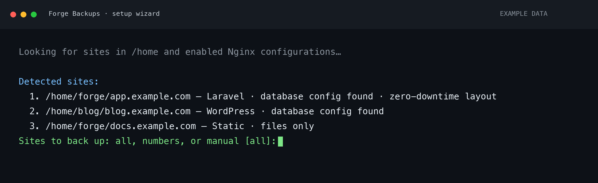
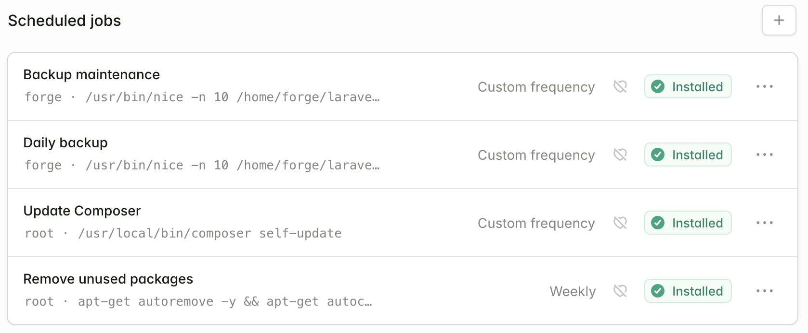

# Laravel Forge Complete Backup

Back up configured Forge site directories and MySQL databases to an encrypted
restic repository, including S3-compatible storage such as Cloudflare R2. Python
processes sites sequentially and sends per-site and summary Discord notifications.
No Forge API or particular Forge plan is required.

## Install on Ubuntu / Forge

These steps install **v0.3.2** on a fresh Ubuntu 22.04, 24.04 or 26.04 Forge
server using the `forge` account. For Ubuntu 20.04, see
[Python requirements below](#prerequisites-and-ubuntu-versions) before continuing.
For an existing v0.2.1 installation, use the [migration guide](#migration-from-v021).
Run each step in order and stop if a command fails.

### 1. SSH into the server

From a terminal on your computer, replace `SERVER_IP` with the server's IP address:

```bash
ssh forge@SERVER_IP
```

If you are already connected as `forge`, continue below. Run setup as `forge`,
without `sudo`.

Have your R2 bucket name, Cloudflare account ID, R2 S3 access key ID / secret,
and a repository password saved in your password manager ready for the wizard.
The storage credentials need read/write/delete access to the bucket. An optional
Discord webhook enables notifications.

One repository and password cover all selected sites on this server. Keep the
password outside the VPS: **losing it makes the backups unrecoverable**. Do not
configure object-expiration lifecycle rules on the backup repository prefix.

### 2. Download the release and start setup

```bash
cd /home/forge
git clone --branch v0.3.2 https://github.com/alexmck/laravel-forge-complete-backup.git
cd /home/forge/laravel-forge-complete-backup
bash install.sh
```

Use Forge's existing system tools, including `mysqldump`; no separate MySQL client
installation is needed when that command is present. The installer checks
prerequisites and installs the project's Python libraries and restic automatically.
If it reports a missing requirement, follow the specific remedy in
[dependency troubleshooting](#dependency-troubleshooting), then rerun setup.

Git's “detached HEAD” message is expected when checking out a release tag.
If the directory already exists, do not delete it or clone over it. For an existing
v0.3.2 checkout, enter that directory and rerun `bash install.sh`.



*Illustrative terminal preview using actual wizard output and fictional sites.*

### 3. Complete the wizard

Answer the prompts as follows:

| Prompt | What to enter |
| --- | --- |
| Server name | Press Enter to use the hostname, or enter a stable, unique server name. |
| R2 account ID or S3 HTTPS endpoint | Paste your Cloudflare account ID. |
| Existing bucket name | Enter your existing R2 bucket name. |
| Repository prefix | Press Enter to use the server name. Use a different prefix for each server sharing a bucket. |
| S3 access key ID / secret access key | Paste the R2 S3 credentials. Input is hidden. |
| Repository password / confirmation | Paste the saved password twice. Input is hidden. |
| Discord webhook URL | Paste the URL, or press Enter to disable notifications. |
| Sites to back up | Press Enter for all detected sites, or enter `1,3`, `1 3`, or `1-3`. Use `manual` to enter a site path yourself. |
| Database configuration, if prompted | Choose the correct config file. Enter `none` only if you intentionally want files without a database backup. |
| Add a site manually? | Enter `n` if the list already includes everything you want. |
| Run the first backup now? | Enter `y` and wait for it to complete. |
| Install these jobs in this user's crontab? | Enter `n` to manage the jobs in Forge using step 4 below (recommended). Enter `y` only if you prefer the installer's direct cron scheduling. |

The wizard detects standard, isolated-user and zero-downtime Forge layouts. It
backs up the containing deployment directory, including releases and shared files.
Missing or unreadable sites need manual attention; discovery does not change
permissions. Database settings are read from supported application configuration.

The default schedule is **03:00 backups / 05:00 maintenance**, in the server's local
timezone. Retention is **7 daily / 4 weekly / 12 monthly**. Maintenance runs only
when due, normally weekly. Do not also add duplicate jobs in Forge.

If the first backup fails, fix the reported issue and rerun:

```bash
cd /home/forge/laravel-forge-complete-backup
venv/bin/python scripts/setup.py
```

Choose **1 — Continue** to retry. Saved settings and passwords are reused.

### 4. Schedule backups in Forge

Choose **one** scheduling method. The instructions below use Forge so both jobs
are visible and editable in its dashboard. Answer **`n`** to the installer's
crontab prompt. Direct cron installation does not register jobs through Forge.

1. Open your server in Forge. On **Overview**, find **Scheduled jobs** and click
   **+**. Alternatively, open **Processes → Scheduler → Add scheduled job**.
2. Create **Daily backup** using the settings and command below, then click
   **Create scheduled job**.
3. Add a second job named **Backup maintenance** using its settings and command.
4. Confirm that both jobs show **Installed** in the scheduled jobs list.

| Field | Daily backup | Backup maintenance |
| --- | --- | --- |
| Name | `Daily backup` | `Backup maintenance` |
| User | `forge` | `forge` |
| Frequency | Custom frequency | Custom frequency |
| Custom schedule | `0 3 * * *` | `0 5 * * *` |
| Monitor with heartbeats | Off | Off |

**Daily backup — Command:**

```bash
/usr/bin/nice -n 10 /home/forge/laravel-forge-complete-backup/venv/bin/python /home/forge/laravel-forge-complete-backup/backup.py backup
```

**Backup maintenance — Command:**

```bash
/usr/bin/nice -n 10 /home/forge/laravel-forge-complete-backup/venv/bin/python /home/forge/laravel-forge-complete-backup/backup.py maintenance
```

Paste the entire command, including the Python interpreter path. Put the cron
expression in **Custom schedule**, not in **Command**. Adjust the paths if you
installed somewhere else.

The default times are **03:00** and **05:00** in the server's timezone. Check
Forge's **Next expected run** and its displayed timezone before saving.
Leave enough time for the backup to finish before maintenance starts. Maintenance
is scheduled daily so failed work retries the next day; repository checks and
pruning normally run only when due each week.

Keep **Monitor with heartbeats** off for these commands. Forge heartbeats require
an explicit success ping, which these commands do not send. Discord notifications
continue to work independently if configured.



**Installed** confirms that Forge created the schedule; it does not mean the job
has run yet. The initial backup was run by the wizard. For additional manual runs,
use SSH and `venv/bin/python backup.py backup`: Forge's **Run** action has a
60-second timeout, while regular scheduled runs do not have that limit.
See [Forge's scheduler documentation](https://laravel.com/forge/docs/resources/scheduler).

#### Alternative: use the installer's cron scheduling

If you answered **`y`** to the crontab prompt, skip creating jobs in Forge. Check
the direct cron installation from SSH:

```bash
crontab -l
systemctl is-active cron
date
```

Check that the crontab contains the `backup.py backup` and `backup.py maintenance`
jobs and cron reports `active`. If cron is inactive:

```bash
sudo systemctl enable --now cron
```

To switch from installer-managed cron to Forge, run `crontab -e` and remove only
the block between `# BEGIN forge-backups ...` and `# END forge-backups ...`,
including those markers. Preserve unrelated jobs, then create the two Forge jobs.
Do not leave both scheduling methods active.

### 5. Keep recovery instructions off the server

From a **new terminal on your own computer**, replace `SERVER_IP` and download the
generated guide:

```bash
scp forge@SERVER_IP:/home/forge/laravel-forge-complete-backup/RECOVERY.md ./forge-backup-recovery.md
```

Save the guide alongside the repository password in your password manager. It
contains your repository address and restore commands, but no credentials. Keep a
copy of the password outside the server; the guide cannot replace it.

Installation is complete after the first backup and scheduling. For a manual backup
later, run on the server:

```bash
cd /home/forge/laravel-forge-complete-backup
venv/bin/python backup.py backup
```

To download and decrypt a snapshot without importing a database, follow the saved
recovery guide or [local restore instructions below](#download-decrypt-and-verify-a-backup-locally).

### Update from v0.3.0 or v0.3.1 to v0.3.2

On each server, as `forge`, run:

```bash
cd /home/forge/laravel-forge-complete-backup
git status --short
git fetch origin --tags
git switch --detach v0.3.2
```

If `git status` lists tracked files you have edited, preserve those changes before
switching versions; do not use a forced checkout. Ignored configuration, storage
credentials and the repository password remain in place. Existing Forge/cron jobs
use the updated code automatically on their next run. This patch does not change
Python dependencies or require rerunning setup or initializing the repository.

To run a backup immediately and view the Discord size fields, run:

```bash
venv/bin/python backup.py backup
```

### Manage an existing installation

Run `venv/bin/python scripts/setup.py` to open the menu without reinstalling dependencies:

1. **Manage sites:** keep selected sites and discover or manually add new ones.
   Retained sites preserve their names, database settings, exclusions and overrides.
   Removing a site stops future backups; it does not delete existing snapshots.
2. **Change retention:** choose daily, weekly and monthly counts. Existing per-site
   overrides remain unless you explicitly remove them. Shorter retention can remove
   older snapshots after the next successful backup.
3. **Change scheduling:** enter daily backup and maintenance times in the server's
   local timezone, then optionally update the installer's managed cron block.
   If Forge manages your jobs, apply the printed entries there. Saving times alone
   does not change existing jobs. Allow enough time between backup and maintenance.
4. **Regenerate the recovery guide:** refresh `RECOVERY.md` without connecting to
   storage or running a backup.

Changes are confirmed before saving. The previous YAML is saved as private
`config.yaml.previous`; storage credential and password files are preserved.
YAML comments/formatting are not preserved when settings are saved. The rollback
copy contains configuration secrets, if any, and is ignored by Git.

Copy `RECOVERY.md` off the server and keep it alongside your repository password
in your password manager. It is generated locally, ignored by Git and updated when
the wizard saves settings. It includes infrastructure paths but no passwords,
access keys or Discord webhook. Recovery works without the original `restic.env`:
enter replacement storage credentials and the original repository password when
following the guide. Generating the guide does not itself test a restore.

### Prerequisites and Ubuntu versions

The backup account must be able to read all configured site files. Isolated Forge
site users may need group/ACL configuration; the installer does not change site
permissions. Python **3.10+**, its `venv` module, and a MySQL/MariaDB dump client for
database-enabled sites are required. Missing prerequisites produce an error with
next steps; the installer does not use sudo or change system packages.
The early check prints Ubuntu install commands for missing tools. Missing database
clients and cron are notices because files-only backups and Forge scheduling do
not require them. Database-enabled sites still require a working dump client.

| Ubuntu release | Default Python | Python requirement |
| --- | --- | --- |
| 24.04 LTS | 3.12 | Meets the requirement. |
| 22.04 LTS | 3.10 | Meets the requirement. |
| 20.04 LTS | 3.8 | Requires a separately installed Python 3.10+. |

Ubuntu 26.04 also meets the requirement. These describe prerequisites, not a claim
that each release has been tested. See Ubuntu's
[Python version reference](https://ubuntu.com/developers/docs/reference/availability/python/).

The installer defaults to `python3` on `PATH`. To select an existing newer Python:

```bash
PYTHON_BIN=/absolute/path/to/python3.12 bash install.sh
```

Do not replace Ubuntu's system Python. An existing virtual environment using an
older Python must be moved aside before creating one with the newer interpreter.

### Dependency troubleshooting

Only install a system package if the installer reports it missing. `which` and
`command -v` look for executable commands, not Ubuntu package names:

| Package | How it is used |
| --- | --- |
| `mysql-client` | Provides MySQL tools such as `mysqldump`; there is no `mysql-client` command. |
| `python3-venv` | Provides Python virtual-environment support; there is no `python3-venv` command. |
| `ca-certificates` | Provides trusted certificates for HTTPS; there is no `ca-certificates` command. |

For missing virtual-environment support with Ubuntu's system Python:

```bash
sudo apt-get update
sudo apt-get install python3-venv
bash install.sh
```

For a separately installed Python, use its matching venv package instead. Python
3.10+ is required; installing venv does not upgrade an older interpreter.

If the check reports a missing MySQL dump client, verify the executable:

```bash
command -v mysqldump
```

If absent, install the client appropriate to your existing database installation.
For MySQL, the Ubuntu package is `mysql-client`. This is an exception path; a Forge
server with `mysqldump` already installed needs no additional database package.

### Advanced installation and configuration

Use `bash install.sh --skip-setup` to install dependencies without interactive
configuration, or `venv/bin/python scripts/setup.py` to run only the setup prompts.
Use `--skip-restic` to manage the restic binary yourself; guided setup then uses an
existing project-local binary or `restic` on `PATH`. Options can be combined.

The installer downloads official restic **0.19.1** for Linux AMD64/ARM64 and checks
the release SHA-256 checksum over HTTPS. It does not depend on Ubuntu's restic
package version or automatically replace an existing binary. Restic 0.19.1+ is
required. To explicitly install the pinned version again:

```bash
python3 scripts/install_restic.py
```

Settings can be edited in `config.yaml` after setup. See `config.yaml.example` for
all settings and `restic.env.example` for storage credentials. For manual setup,
create these files and a `restic-password` file containing your saved password,
set their permissions to `0600`, and use absolute paths in the configuration.
Then run `venv/bin/python backup.py init` once for a new repository, followed by
`venv/bin/python backup.py backup`.

Each server should use its own stable repository prefix, such as
`s3:https://ACCOUNT.r2.cloudflarestorage.com/BUCKET/forge-server-1`. R2 uses region
`auto`. Do not enable S3 object-expiration lifecycle rules on a restic prefix;
restic manages retention itself.

The environment file accepts AWS access keys, session token, region, and
`RESTIC_PASSWORD_FILE`/`RESTIC_PASSWORD`. Shell commands and interpolation are not
evaluated. A configured password file takes precedence over a password variable.

## Discord backup sizes

Each successful site notification (including a saved backup with a retention warning)
shows three separate sizes:

- **Database size:** the validated, uncompressed SQL dump only.
- **Total files processed:** the uncompressed size processed by restic, including
  site files, the SQL dump when enabled, and backup metadata.
- **Data uploaded:** new compressed data added to the repository during this backup.
  Restic reuses existing data, so this can be much smaller than the total processed.
  It is restic's reported data addition, not an exact network-traffic measurement
  or the total repository size.

Sizes use KiB/MiB/GiB. Unreported statistics show **Unavailable**, not zero.

## Resource usage

Sites run one at a time, with one restic file reader, one Go execution core and two
S3 connections. Files go directly to restic; there is no intermediate site copy or
`.tar.gz`. SQL is streamed to disk and removed after each site. Restic also uses
cache and temporary pack files. `work_dir` must be disk-backed, not tmpfs.

The default free-disk reserve is **1024 MiB**. It is checked before work, during SQL
writes and while restic runs. Crossing it aborts the operation; this is a guard,
not a filesystem quota or a guarantee against concurrent disk use by the site.
Allow enough additional space for the largest site's **uncompressed SQL dump**.
The cache has no fixed size cap. Do not lower the reserve simply to force a backup
onto a full server.

These settings reduce resource demand, but do not impose a hard RAM ceiling.
Large repositories may require checks/pruning on another machine or a larger VPS.
Full data checks download all repository data without creating a full local
restored copy.

## Database configuration

`backup_database: true` is the default. It must be explicitly false for files-only
sites. A missing client, ambiguous configuration, bad credentials or invalid dump
fails the site before restic runs.

Without an explicit `database.config_file`, runtime discovery requires exactly one
of these files under `user_path`:

- `.env`: `DB_HOST`, `DB_PORT`, `DB_DATABASE`, `DB_USERNAME`, `DB_PASSWORD`, optional
  `DB_SOCKET`; `DB_CONNECTION` must be `mysql` or `mariadb` when provided.
- `public/wp-config.php`: static `DB_*` definitions.
- `public/LocalSettings.php`: static `$wgDB*` assignments.
- `public/conf_global.php`: static `$INFO` assignments or array entries.

The wizard also checks site roots, `public`, `current` and shared configuration
locations, and saves an explicit `database.config_file`. For zero-downtime sites it
keeps the configuration path through `current` so it follows future deployments,
and selects the containing site directory with its releases and shared files.

When configuring another layout manually, set `database.config_file` to the
absolute path. Back up the containing site directory
that includes actual release/shared files: restic preserves symlinks, it does not
follow arbitrary links to files outside the source tree.

PHP is never executed. Dynamic expressions, interpolation and ambiguous sources
require an explicit override. `.env` quoting/comments are parsed with python-dotenv;
variable interpolation is intentionally disabled. Cached Laravel configuration may
differ from `.env`; choose explicit settings if `.env` is not authoritative.

Prefer an existing protected MySQL option file:

```yaml
database:
  name: application_db
  option_file: /home/forge/.mysql-backup.cnf
  dump_binary: mysqldump  # Use mariadb-dump for a MariaDB client.
  timeout_seconds: 1800
```

The option file must have permissions `0600` or `0400`, with a `[client]` section:

```ini
[client]
host="127.0.0.1"
port=3306
user="backup_user"
password="your password"
```

Alternatively set `database.name`, `user`, `password`, and optionally `host`, `port`
or `socket` in the private YAML. Supply all three credential fields to bypass
automatic discovery; an empty password is allowed. With `option_file`, credentials
come from that file and other credential overrides are ignored.

For discovered/inline credentials, the script writes a temporary `0600` option file
outside snapshot sources. Passwords never appear in process arguments. It disables
inherited `MYSQL_PWD`/login-file settings and uses `--defaults-file` as the first
option. Subprocess stderr is deliberately not copied into logs or Discord because
it can contain credentials or SQL. Failure messages include the operation and exit
status; investigate with the same client and protected option file when needed.

Dumps use `--single-transaction --quick --routines --triggers --events --hex-blob
--no-tablespaces`; MySQL also uses `--set-gtid-purged=OFF`. The database user needs
privileges to read tables/views and export routines, triggers and events. Dump
checks and SHA-256 metadata detect common incomplete output but do not validate SQL
import compatibility. Transactional consistency applies to transactional tables.
Avoid schema changes during dumps; files and SQL are not an atomic application-wide
snapshot. Nontransactional tables need separate coordination.

## Exclusions and retention

`exclude_patterns` are scoped to site files. Basename patterns such as `*.log` or
`node_modules` match at every depth; patterns containing `/` are relative to
`user_path`. Absolute paths, parent traversal and negation are rejected. SQL and
manifest files are explicit backup inputs, so site exclusions cannot remove them.
The work directory, restic secrets, explicit MySQL option file, and backup YAML are
excluded automatically. Application `.env` files remain part of encrypted backups.

Defaults are 7 daily, 4 weekly, and 12 monthly snapshots. Override any count with
`retention: {daily: 14}` per site; zero disables that tier, but all-zero retention
is rejected. Restic keeps the union of these policies, based on periods containing
backups, rather than an exact age cutoff. Retention runs only after a successful
site snapshot, filtered by `forge-backup`, server, site and `complete` tags and
grouped by host/tags. Keep names/server IDs stable to retain the same history.
While history is still filling up, restic can also preserve the oldest snapshot
for an unsatisfied retention tier.

Pruning is separate from snapshot retention. Default maintenance runs a structural
check and reads the next **1/4** of repository data every seven days, then prunes
with at most **128 MiB** of repacking. The subsets rotate only after successful
checks. This spreads verification across roughly four weeks; repository changes
mean it is not a single point-in-time full verification. Use `check` for a full read.
This repack limit bounds rewritten data, not memory. Failed checks skip pruning.
State is written atomically per repository; a failed operation stays due for retry.

Interrupted/partial snapshots lack `complete` and are deliberately outside automatic
retention. Inspect and explicitly forget their IDs after a successful replacement.
Do not blindly restore `latest` without the complete/site filters below.

## Schedule and operate

For Forge dashboard setup, follow [step 4 above](#4-schedule-backups-in-forge).
For direct cron, use the entries below with the same account and absolute paths. Run maintenance daily so a failed weekly operation retries the
next day. The state file determines whether checks/pruning are due. Adjust hours
to leave enough time for your backups; all commands share a nonblocking local lock.
An overlapping job exits nonzero and sends a failure notification.

```cron
0 3 * * * /usr/bin/nice -n 10 /home/forge/laravel-forge-complete-backup/venv/bin/python /home/forge/laravel-forge-complete-backup/backup.py backup >> /home/forge/laravel-forge-complete-backup/cron.log 2>&1
0 5 * * * /usr/bin/nice -n 10 /home/forge/laravel-forge-complete-backup/venv/bin/python /home/forge/laravel-forge-complete-backup/backup.py maintenance >> /home/forge/laravel-forge-complete-backup/cron.log 2>&1
```

The direct cron entries above write to `cron.log`; use logrotate to bound its size. Logs go to stderr; there is no duplicate
`backup.log`. SIGTERM/interrupts terminate child process groups and clean temporary
credentials/dumps where possible. OS locks release on exit. A hard kill can leave
staging files; each site's staging is cleared before its next backup and stale
generated credentials are cleared on startup. Do not manually delete the lock file.
Never run two installations for the same server with different work directories.

```bash
venv/bin/python backup.py maintenance  # Run only due maintenance.
venv/bin/python backup.py check        # Force a full repository read/check.
venv/bin/python backup.py --config /absolute/config.yaml backup
```

## Download, decrypt and verify a backup locally

Restic's `restore` command extracts ordinary, decrypted files into a folder. It does
not deploy the site, run PHP, connect to MySQL or import the SQL dump. There is no
single encrypted `.tar.gz` to download from R2; restic reconstructs the selected
snapshot from the repository's encrypted objects.

1. Install restic on your computer (`brew install restic` on macOS). Copy your
   `restic.env` and `restic-password` from the server into a private local directory,
   such as `$HOME/.config/forge-backups`, and set both files to mode `0600`. Load the
   credentials and use the same repository address as the server:

   ```bash
   set -a
   . "$HOME/.config/forge-backups/restic.env"
   set +a
   export RESTIC_REPOSITORY='s3:https://ACCOUNT.r2.cloudflarestorage.com/BUCKET/forge-server-1'
   export RESTIC_PASSWORD_FILE="$HOME/.config/forge-backups/restic-password"
   export AWS_DEFAULT_REGION=auto
   restic snapshots --tag 'forge-backup,server:forge-server-1,site:website1-com,complete'
   ```

2. Pick the exact snapshot ID (also shown in Discord). Download it to a new, empty
   local folder and verify the restored file contents:

   ```bash
   restic restore SNAPSHOT_ID --target "$HOME/forge-restore" --verify
   ```

   Absolute source paths are recreated underneath the target. The site appears at
   `$HOME/forge-restore/home/www-website1-com`. SQL and `manifest.json` appear
   under the restored original work directory, for example:
   `$HOME/forge-restore/home/forge/laravel-forge-complete-backup/.backup-work/staging/website1-com/`.
   The manifest records the database name, dump path, byte count and SHA-256.

3. Open the restored files and inspect `database.sql` in a text editor. A successful
   `restore --verify` confirms that the snapshot can be downloaded, decrypted and
   reconstructed with matching file contents. SQL remains a file; nothing is
   imported into a database. The local files are now plaintext, so keep the download
   folder private, especially its application `.env` files and SQL.

File verification checks restored contents, not whether MySQL can import the SQL.

### Recover a database or application

To recover a database, provision an **empty destination database** and a private
client option file, then import the downloaded SQL:

```bash
mysql --defaults-file="$HOME/.mysql-restore.cnf" restored_database < "$HOME/forge-restore/home/forge/laravel-forge-complete-backup/.backup-work/staging/website1-com/database.sql"
```

Use the compatible MariaDB client for MariaDB dumps. Database users/grants are not
included in a single-database dump. Confirm tables, application data and files
before switching production traffic to the recovered application. Production
cutover needs maintenance mode, correct file ownership/permissions, environment
settings and application checks. Restore on another machine if the VPS cannot
hold a second copy.

## Migration from v0.2.1

1. Keep the `v0.2.1` tag and existing `.tar.gz` objects. Pause the old scheduled job.
2. Install dependencies/restic. Replace `global.s3` with `global.restic`; move storage
   credentials into the protected environment file and create a repository password.
3. Replace `retention_days` with `retention.daily/weekly/monthly`; remove
   `compression_level`. The old value counted archives, not days. Review exclusion
   paths and database discovery. Preserve notification settings and site names.
4. Use a new restic prefix, initialize, run a backup, and enable both scheduled jobs.
   Existing archives are not imported or deleted by this system. Remove them only
   after separately deciding your migration retention period.

Rolling back the code does not convert restic snapshots into archives: restore the
old configuration and schedule alongside the tagged code if rollback is needed.

## Development

See [DEVELOPMENT.md](DEVELOPMENT.md) for contributor setup and automated tests.

## References

- [Restic installation](https://restic.readthedocs.io/en/stable/020_installation.html)
- [S3-compatible repositories](https://restic.readthedocs.io/en/stable/030_preparing_a_new_repo.html)
- [Restic retention](https://restic.readthedocs.io/en/stable/060_forget.html)
- [Restic integrity checks](https://restic.readthedocs.io/en/stable/045_working_with_repos.html)
- [MySQL dump behavior](https://dev.mysql.com/doc/refman/8.0/en/mysqldump.html)
